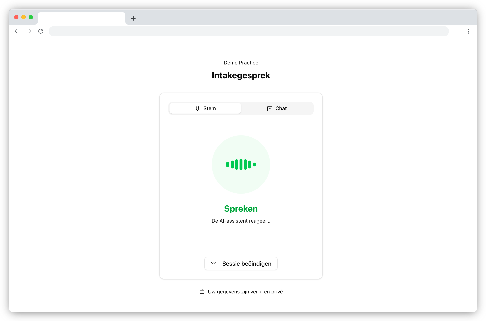

# Patient Intake Demo

This demo shows how to integrate the Squire Patient Intake SDK into an EHR system. Intake has three parts:

1. **Schedule** — SDK methods to create intake sessions and generate patient links
2. **Configure** — Embed the `intake-settings` widget so HCPs can configure which topics are covered during intake
3. **Use** — Embed the `intake-summary` widget to view completed intake data

<div align="center">
  
</div>

## Getting Started

### 1. Clone the repository and install dependencies

```sh
git clone https://github.com/squirehealth/fhir-patient-intake-demo.git
cd fhir-patient-intake-demo

echo "@squirehealth:registry=https://pkg.squire.eu/npm/
//pkg.squire.eu/npm/:_authToken=<YOUR_PACKAGE_REPOSITORY_TOKEN>" > .npmrc
npm install
npm run dev

# Now open your browser and navigate to:
# http://127.0.0.1:8080/
```

To run this, make sure you have installed [Node.js](https://nodejs.org/).

To get a `YOUR_PACKAGE_REPOSITORY_TOKEN`, log in to the [Squire Portal](https://acc.squire.eu/) and find it under your account settings.

### 2. Requesting an API key

1. Log in to the [Squire Portal](https://acc.squire.eu/) (create an account if you don't have one yet).
2. Navigate to the "API Keys" section in your account settings.
3. Click on "Create New API Key" and follow the prompts to generate your key.

> [!IMPORTANT]
> Your API key is a secret, and should not be exposed in client-side code.

### 3. Requesting an access token

An access token is required to authenticate your requests to the Squire API. You can obtain an access token by making a POST request to the token endpoint with your API key and user details.

```sh
curl -X POST "https://api-acc.squire.eu/api/v1/token/" \
  -H "X-Api-Key: <YOUR_API_KEY>" \
  -H "Content-Type: application/json" \
  -d '{"user_id": "example1234", "first_name": "doctor", "last_name": "123", "organisation_id": "<YOUR_ORGANISATION_ID>", "organisation": "<YOUR_ORGANISATION_NAME>"}'
```

> [!NOTE]
> `organisation_id` is your **data scope** — it identifies the practice or hospital department whose intake data you want to access. All users sharing the same `organisation_id` see the same intake configurations and session data. You can find your organisation's ID in the [Squire Portal](https://acc.squire.eu/).

Once you have the access token, paste it into the demo UI to initialize the SDK.

> [!NOTE]
> In a real life application, you would request the access token per end user on your backend server. For simplicity reasons, we are pasting it in the demo UI.

## How It Works

### SDK Initialization

```js
const squire = new Squire({
  token: '<ACCESS_TOKEN>',
  apiUrl: 'https://api-acc.squire.eu',
  embedUrl: 'https://widget-acc.squire.eu',
  outputLanguage: 'nl'
});
```

### 1. Schedule — Create Intake Sessions

Use the SDK's intake service to create a session and generate a link for the patient.

First, fetch the available intake configurations to get the `intakeConfigId`:

```js
const configs = await squire.intake.getIntakeConfigs();
// configs: [{ id: 'uuid', name: 'General intake' }, ...]
```

Then create a session using the desired config's `id`:

```js
const session = await squire.intake.createSession({
  intakeConfigId: configs[0].id,
  appointmentDt: new Date('2026-06-15T10:00:00'),
  firstName: 'Jan',
  lastName: 'de Vries',
  email: 'jan@example.com',
  phoneNumber: '+32 6 1234 5678',
  healthcareProviderId: 'user-uuid',  // optional
});

console.log(session.intakeUrl);  // Link for the patient
console.log(session.id);         // Track the session
```

**CreateIntakeSessionOptions:**

| Field | Type | Required | Description |
|---|---|---|---|
| `intakeConfigId` | `string` | Yes | ID of the intake configuration (from the settings widget) |
| `appointmentDt` | `Date \| string` | Yes | Appointment date/time |
| `firstName` | `string` | No | Patient's first name |
| `lastName` | `string` | No | Patient's last name |
| `email` | `string` | No | Patient's email address |
| `phoneNumber` | `string` | No | Patient's phone number |
| `healthcareProviderId` | `string` | No | ID of the healthcare provider (user) |

### 2. Configure — Intake Settings Widget

Embed the `intake-settings` widget in your EHR settings page so HCPs can manage which questionnaires are used for intake:

```js
const widget = squire.mountWidget(
  '#squire-intake-settings',
  'intake-settings',
  {
    locale: 'nl',
    theme: {
      colorPrimary: '#337ab7',
      colorDark: '#212529',
      colorLight: '#236aa7',
      colorLightest: '#f8f9fa',
      borderRadius: '1rem',
      font: 'Roboto',
    }
  }
);

widget.on('loaded', () => {
  console.log('Intake protocols widget loaded');
});
```

### 3. Use — Intake Summary Widget

Embed the `intake-summary` widget in your patient dossier or consultation view to show completed intake data:

```js
const summaryWidget = squire.mountWidget(
  '#squire-intake-summary',
  'intake-summary',
  {
    sessionId: 'int_a1b2c3d4e5f6g7h8',
    locale: 'nl',
    theme: { /* same theme object */ }
  }
);

summaryWidget.on('loaded', () => {
  console.log('Intake summary loaded');
});
```

## FHIR-A-THON 2026 — Next Steps

### 1. Integrate intake into your workflow

- Create sessions programmatically from your EHR/PMS
- Poll for completed sessions or set up webhooks
- Display results using the intake-summary widget

### 2. Combine with Speech-to-FHIR

Use the intake data as pre-populated context for a Speech-to-FHIR consultation session. The patient fills in the intake form before the appointment, and the HCP uses voice during the consultation.

## Widget Theming

Both widgets accept a `theme` object for visual customization:

| Property | Description |
|---|---|
| `colorPrimary` | Primary brand color |
| `colorDark` | Dark text / background color |
| `colorLight` | Light accent color |
| `colorLightest` | Lightest background color |
| `borderRadius` | Border radius for UI elements |
| `font` | Font family name |

## Useful Links

- [Squire SDK Documentation](https://developers.squire.eu/): Guide on how to use the Squire SDK
- [Squire API Documentation](https://acc.squire.eu/api/v1/external/docs/): API reference for Squire's backend services
- [Squire Portal](https://acc.squire.eu/): Manage your account, API keys, and FHIR Questionnaires

## About

This demo application is a minimal example to illustrate how the Squire SDK can be used for patient intake workflows. The SDK offers support for all frontend setups (React, Angular, Vue, plain JavaScript, etc.) as well as backend environments (Java, .NET, Python, etc.). No bundler is used here for simplicity purposes, but it works with any of your liking (Vite, Webpack, ...). TypeScript support is also included out of the box.

For more information, visit [the Squire website](https://squire.eu/).


